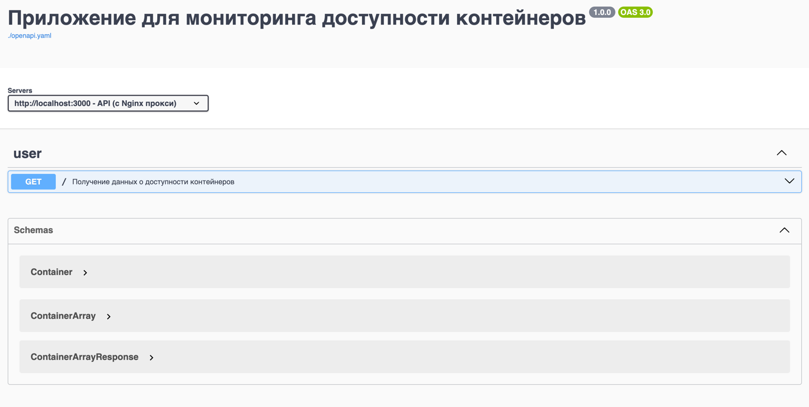

# Тестовое задание "Приложение мониторинга контейнеров"

## Содержание
- [Задание](#задание)
- [Использование](#использование)
- [Реализация](#реализация)
    - [Схема сервисов](#схема-сервисов)
    - [Структура проекта](#структура-проекта)
    - [Пример запросов](#пример-работы-приложения)

___
### Задание
Необходимо написать приложение с использованием Go и JS, которое будет отслеживать состояние контейнеров.

Приложение состоит из 4 компонентов:
1. Backend-сервис
2. Frontend-сервис 
3. БД PostgresSQL
4. Pinger-сервис

___
## Использование
1. Склонировать репозиторий: ```git clone https://github.com/Saljaev/app-pinger```, прописать ```cd app-pinger```.
2. Прописать ```make prepare```, который сгенерирует файлы конфигурации и .env для работы приложения.
3. Прописать ```make build``` (собирает docker compose), а затем ```make start``` (docker compose up).
4. Если прописать ```make docs-start```, то можно будет посмотреть документацию [openapi](http://localhost:9000) и
[asyncapi](http://localhost:9001?url=/docs/asyncapi.yaml). *(или прописав http://localhost:9000 / http://localhost:9001).* Потом нужно прописать ```make docs-stop```
или для удаления ```make docs-delete```

5. Для просмотра состояния контейнеров перейти на [ссылку](http://localhost:3000), там будет таблица со всеми данными.
*(или прописав http://localhost:3000)*
6. Для настройки приложения нужно менять переменные окружения в файле .env. После работы прописать ```make delete```
   (docker compose down -v).
___
## Реализация:
***Frontend-сервис:*** написан с использованием **React**, был написан собственный компонент  [IpTable](frontend/src/components/IpTable.js),
который содержит в себе таблицу с данными о контейнерах, стиль для которой используется из antd. Этот компонет использует
axios для отправки запроса Get, чтобы получить контейнеры. Таблицу можно сортировать по адресам и последнему времени
доступности, фильтровать по доступности.

Используется **nginx**, который загружает страницу с таблицей и работает в качестве прокси сервера между frontend и backend.
___
***Backend-сервис:*** написан с возможностью легкой замены реализации БД благодаря интерфейсам.
Используется миграции из пакета go-migrate, запросы написаны на чистом SQL с подключенным драйвером postgres.
Общение с frontend происходит с помощью собственной обертки на **context** и **router**, перед этим используется 
верификатор, который использует простое идентифицирование, а также содержит в себе **rate-limiter**.
   
С сервисом pinger общение происходит с помощью брокера сообщений **RabbitMQ**, это общение настроено в [pkg](pkg/queue).
Там же лежит папка с контрактами, которыми обмениваются два сервиса.
___
***Pinger-сервис:***, написан с возможностью легкой замены сервиса, который производит пинги. В основе лежит использование 
**Docker SDK** чтобы инспектировать контейнеры и получать IP-адреса, а также go-ping чтобы проводить пинг. Так как используется 
контейнер scratch, было решено вместо **netns** использовать возможность подключения к сетям с помощью Docker SDK, для этого
сервесу нужно знать свое имя, а сети контейнеров он найдет, когда будет получать их адреса.

Используется **[фильтр](pinger/list.txt)** адресов, который является универсальным и может
быть как черным, так и белым, главное указать тип в файле, писать в него можно как IP-адреса контейнеров, так и их названия,
собирается с помощью **go:embed**. Если он пуст - никакой фильтр не используется. Пинги проводятся **паралельно**
с использованием горутин, waitgroup и мьютексов.
___
***PostgresSQL:*** В качестве PrimaryKey  выбрал IP-адрес контейнера, что позволило реализовать минимальное количество запросов. Первый это
получить все данные, а второй содержит в себе структуру _ON CONFLICT DO UPDATE_, благодаря которому можно не использовать
дополнительный запрос на обновление.
___
***Общие моменты:*** 
* Разработка происходила на ветке *dev*, основной веткой является *prod.* 
* Сервисы pinger и backend
содержат в себе два уровня логирования: _info_ и _debug_.
* Старался максимально вынести настройки серверов в переменные
окружения, чтобы деплоить и изменять параметры было легче, например: для pinger - частота опроса сервиса, 
количество отправляемых пакетов, ожидание время пинга; настройки RabbitMQ и PostgresSQL и т.д.
* Написана документация
для HTTP [openapi](docs/openapi.yaml) и для RabbitMQ [asyncapi](docs/asyncapi.yaml). 
* Написал unit тесты для pinger и backend.

Чтобы применить приложение по назначению, нужно лишь установить и запустить в docker compose.
___
## Схема сервисов
```
                           +-------+                       +----------+  
       +-------------------| nginx |                       | rabbitmq |
       |                   +-------+                       +----------+
       |                       |                                 |
       |    +----------+       |       +-----------------+       |      +--------+
user --+--> | frontend | <-----+-----> |     backend     | <-----+----- | pinger |
            +----------+               +--------+--------+              +--------+
                                                |
                                                |
                                                |
                                                |
                                          +-----+------+
                                          |  postgres  |  
                                          +------------+
```  

___
### Структура проекта
```
backend
├── cmd
│   └── backend
│       └── main.go <- Точка входа в backend
├── config
│   └── verifier_config.yaml <- Конфигурация для verifier
├── internal
│   ├── api
│   │   ├── handlers
│   │   │   ├── containers
│   │   │   │   └── ... <- Обработчик запросов
│   │   │   └── verifier
│   │   │       └── ... <- Обработчик верификации
│   │   └── utilapi
│   │       └── ... <- Обертка для контекста и роутера
│   ├── config
│   │   ├── config.go <- Конфигурация backend
│   │   └── verifier.go <- Конфигурация verifier
│   ├── entity
│   │   └── container.go <- Сущность контейнера
│   ├── migrations
│   │   └── ... <- Файлы миграции
│   └── usecase
│       ├── repo
│       │   └── postgres
│       │       └── db.go <- Реализация БД
│       └──storage.go <- Интерфейс SQL запросов
└── Dockerfile <- Файл сборки backend
docs
├── asyncapi.yaml <- Документация для RabbitMQ 
├── docker-compose.yaml <- Конфигурация контейнеров с документацией
└── openapi.yaml <- Документация для HTTP
frontend
├── public
│   └── ... 
├── src
│   ├── components
│   │   └── IpTable.js <- Собственный компонент
│   ├── App.js <- Основной компонент
│   ├── index.js <- Точка входа в frontend
│   └── ... 
├── Dockerfile <- Файл сборки контейнера frontend
├── nginx.conf.template <- Конфигурация nginx
└── ...
pinger
├── config
│   └── config.go <- Создание конфига pinger
├── service 
│   └── pinger.go <- Интерфейс и реализация сервиса
├── Dockerfile <- Файл сборки контейнера pinger
├── list.txt <- Фильтр имен/адресов
└── main.go <- Точка входа в pinger
pkg
├── confing
│   └── config.go <- Загрузка и создание конфигов
├── contracts
│   └── container_add.go <- Контракт обмена данных
├── loger
│   └── log.go <- Создание логера
└── queue
    └── rabbitmq.go <- Работа с брокером сообщений
.env <- Переменные окружения для настройки и деплоя
docker-compose.yaml <- Конфигурация всех контейнеров
```
___

## Пример работы приложения
**Документация openapi**
<br><br><br>
**Документация asyncapi**
<br><br><br>
**Мониторинг доступности**
<br><br>


   
